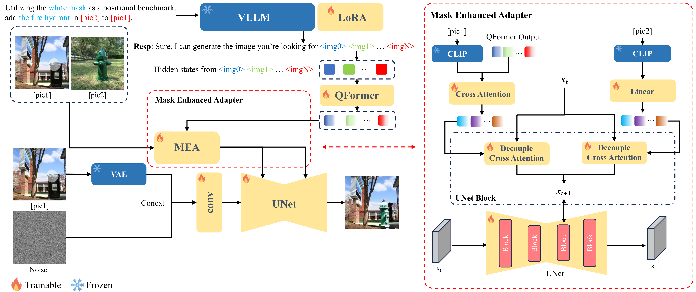

# FlexEdit: Marrying Free-Shape Masks to VLLM for Flexible Image Editing
we propose FlexEdit, an end-to-end image editing method that leverages both free-shape masks and language instructions for Flexible Editing. 

 The following image is the architecture of the FlexEdit framework.FlexEdit integrates visual prompts and human instructions for complex image editing. It utilizes a VLLM backbone for multi-modal instruction understanding, a Q-Former for refining the hidden states, and a Mask Enhanced Adapter (MEA) for merging image and language model outputs. The final image generation is achieved through a diffusion model.

The following image is multiple images editing comparison on rectangle mask, rectangle open mask, triangle mask, triangle open mask

Code and data will be available soon.